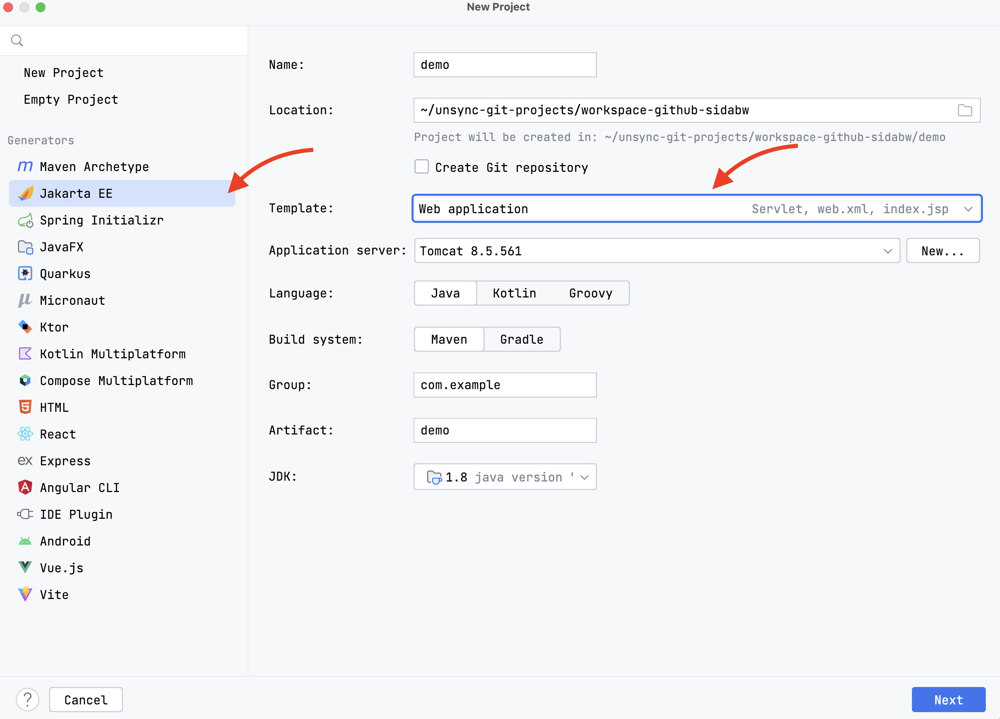
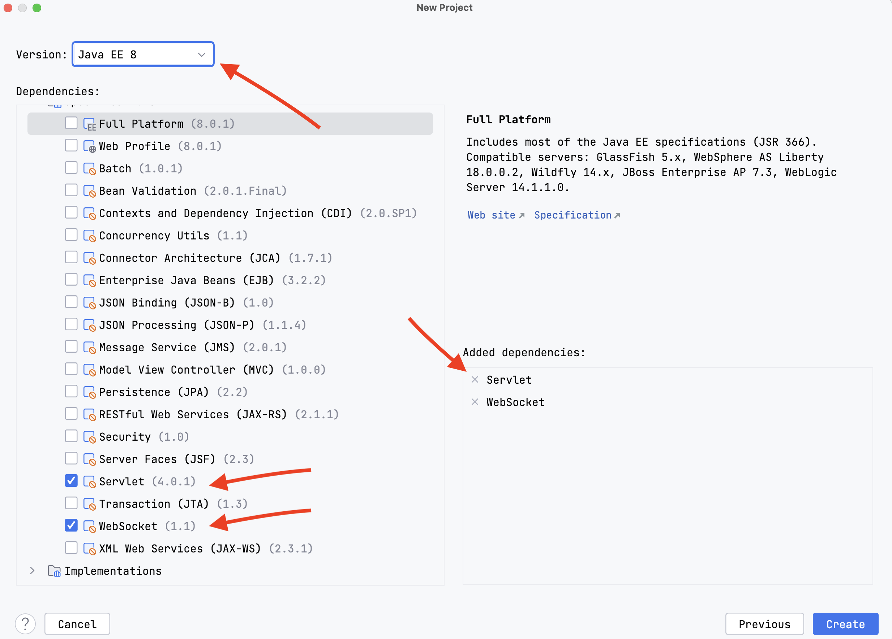

# servlet

### servlet-api
> 基于最新的javax.servlet-api构建注解式Java EE项目，并部署在外部容器tomcat中（在IDEA中配置）

* 使用IDEA配置tomcat时，选择xxx war:exploded
* prework目录下的使用web.xml的手动配置servlet和mapping方式，HelloServlet使用的最新的注解方式，原理都是一样的

### websocket-api

* ws的依赖如pom（`javax.websocket-api`）所示，scope为provided，表示外部容器（tomcat）提供
* 创建一个原始的java-web项目，参考如下步骤

##### step1

##### step2

